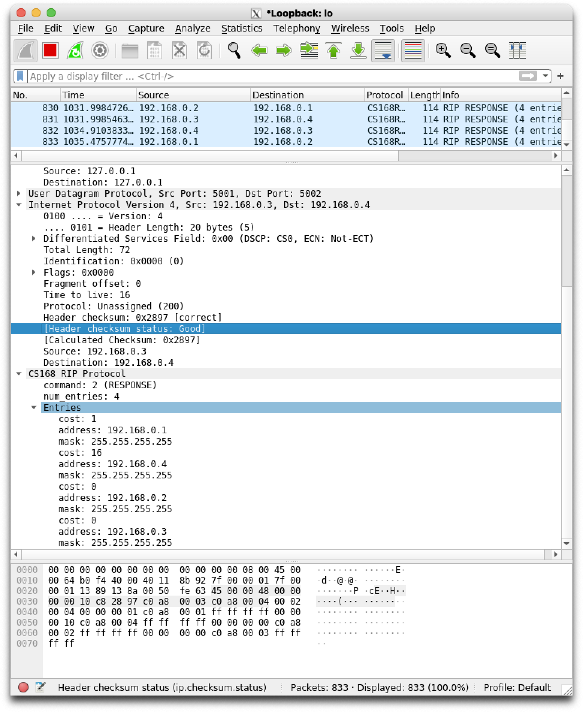

## Q: what part of the packet changed during IP forwarding?

The checksum of the virtual IP header changed, since this packet's (src, dest) pair changed during packet forwarding.

## Q: What node sent this RIP update? To which node was it sent?

Node B (port 5001) sent this RIP update to Node C (port 5002).

## Q: What entries are sent in the update? Do you observe instances of split horizon/poison reverse?

The RIP packet contains 4 entries:

- Advertising B's cost to A is 1
- Advertising B has two interfaces (cost 0).
- Advertising cost to C as infinity (split horizon with poison reverse).

